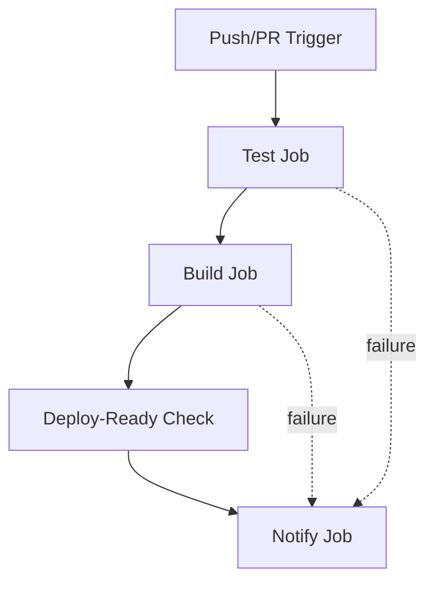
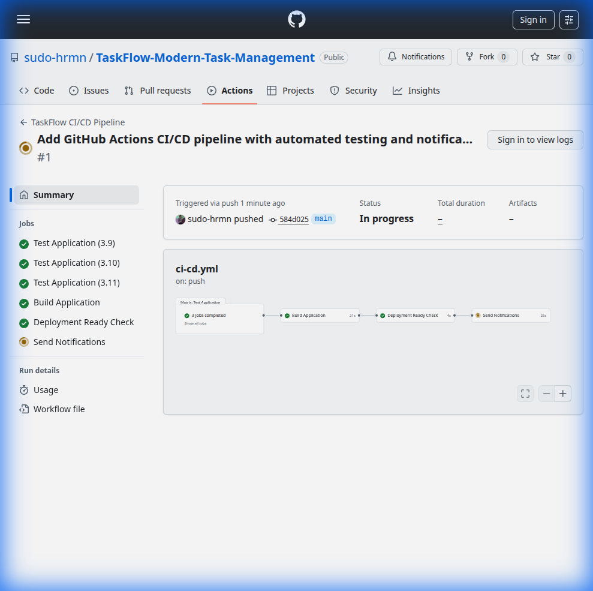
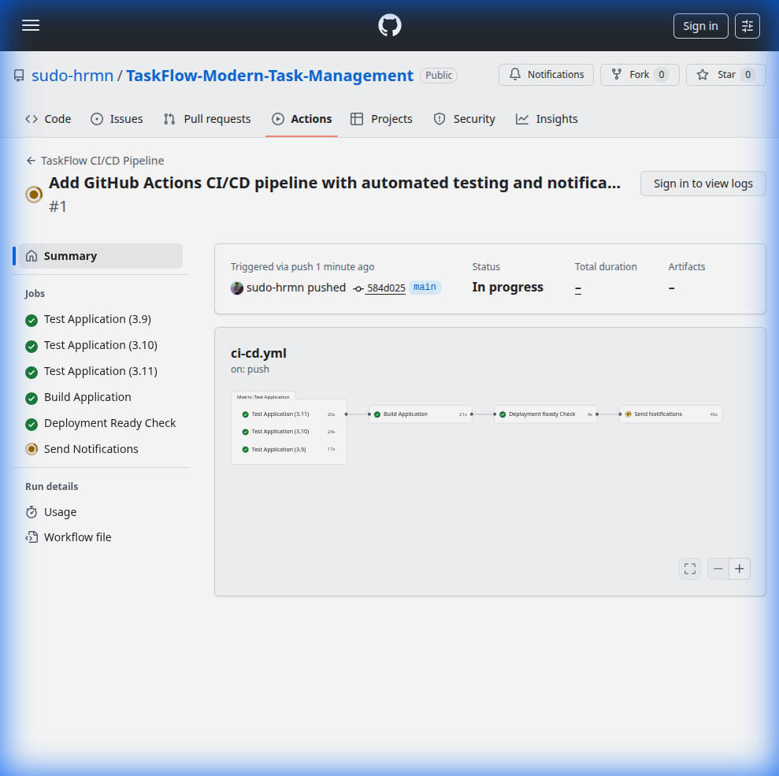
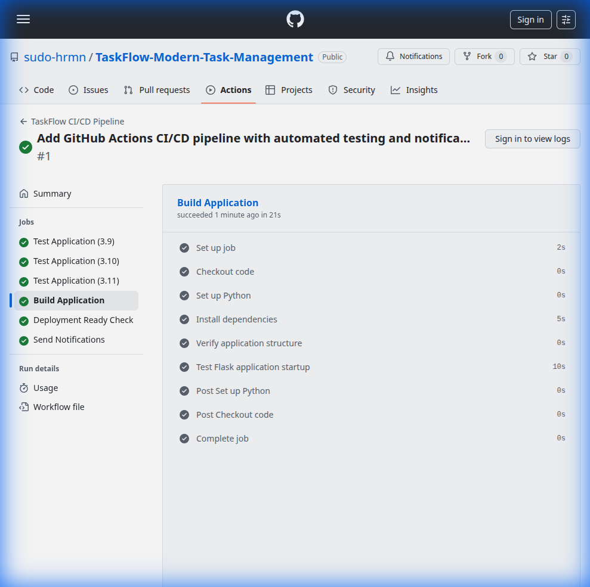

# GitHub Actions CI/CD Pipeline Documentation

**Repository**: [TaskFlow-Modern-Task-Management](https://github.com/sudo-hrmn/TaskFlow-Modern-Task-Management)

## Overview

TaskFlow uses **GitHub Actions** for continuous integration and continuous deployment (CI/CD). The pipeline automatically tests, builds, and validates every push and pull request.

## 🎯 Pipeline Features

### ✅ Automated Testing
- Runs on **Python 3.9, 3.10, and 3.11** simultaneously
- 7 comprehensive test cases covering all API endpoints
- **97% code coverage** with detailed reports
- Tests run on every push and pull request

### ✅ Code Quality Checks
- **flake8** linting for Python code style
- Syntax error detection
- Code complexity analysis
- PEP 8 compliance checking

### ✅ Build Verification
- Tests application startup
- Verifies all required files exist
- Ensures Flask server responds correctly
- Validates project structure

### ✅ Email Notifications
- Automatic notifications on success/failure
- Detailed workflow information
- Direct links to failed runs
- Configurable via GitHub Secrets

---

## 📋 Workflow Structure

### Jobs Overview



### 1. **Test Job** (`test`)
- **Matrix Strategy**: Tests across Python 3.9, 3.10, and 3.11
- **Steps**:
  - Checkout code
  - Set up Python environment
  - Install dependencies (with pip caching)
  - Run flake8 linting
  - Execute pytest with coverage
  - Upload coverage reports to Codecov

### 2. **Build Job** (`build`)
- **Depends on**: Test job must pass
- **Steps**:
  - Checkout code
  - Set up Python 3.11
  - Install dependencies
  - Verify application structure
  - Test Flask server startup

### 3. **Deploy-Ready Check** (`deploy-ready`)
- **Depends on**: Test and Build jobs must both pass
- **Purpose**: Confirms application is ready for deployment
- **Output**: Success confirmation message

### 4. **Notify Job** (`notify`)
- **Runs**: Always (even on failure)
- **Depends on**: All previous jobs
- **Steps**:
  - Check overall workflow status
  - Send email notification with results

---

## 🔧 Setup Instructions

### Step 1: GitHub Secrets Configuration

For email notifications to work, you need to configure these GitHub Secrets:

1. Go to your repository on GitHub
2. Navigate to: **Settings** → **Secrets and variables** → **Actions**
3. Click **New repository secret**
4. Add the following secrets:

| Secret Name | Description | Example |
|-------------|-------------|---------|
| `EMAIL_USERNAME` | SMTP username (usually your email) | `your-email@gmail.com` |
| `EMAIL_PASSWORD` | SMTP app password | `your-app-password` |
| `EMAIL_TO` | Recipient email address | `notifications@example.com` |

#### 📧 Gmail Setup (Recommended)

If using Gmail:

1. Enable 2-Factor Authentication on your Google Account
2. Generate an App Password:
   - Go to: https://myaccount.google.com/apppasswords
   - Select "Mail" and your device
   - Copy the generated 16-character password
3. Use this app password for `EMAIL_PASSWORD` secret

**Note**: Never use your actual Gmail password!

### Step 2: Alternative - Slack Notifications

To use Slack instead of email:

1. Create a Slack Incoming Webhook:
   - Go to: https://api.slack.com/messaging/webhooks
   - Create a new webhook for your channel
   - Copy the webhook URL

2. Add to GitHub Secrets:
   - Secret Name: `SLACK_WEBHOOK_URL`
   - Value: Your webhook URL

3. Modify `.github/workflows/ci-cd.yml`:
   ```yaml
   - name: Send Slack notification
     uses: 8398a7/action-slack@v3
     with:
       status: ${{ job.status }}
       text: ${{ steps.check.outputs.message }}
       webhook_url: ${{ secrets.SLACK_WEBHOOK_URL }}
     if: always()
   ```

### Step 3: Verify Workflow

1. Push changes to trigger the workflow:
   ```bash
   git add .
   git commit -m "Add CI/CD pipeline"
   git push origin main
   ```

2. View workflow progress:
   - Go to: **Actions** tab on GitHub
   - Click on the latest workflow run
   - Monitor each job's progress

---

## � Workflow Screenshots

### Workflow Overview



*Complete CI/CD pipeline showing all jobs (Test, Build, Deploy-Ready, Notify)*

### Test Matrix - Multi-Version Testing



*Automated testing across Python 3.9, 3.10, and 3.11 simultaneously*

### Build Job Execution



*Build verification ensuring application starts correctly*

### README with CI/CD Badge


*CI/CD status badge displayed in the repository README*

---

## �📊 Test Coverage

Current test coverage: **97%**

### Test Suite (`tests/test_app.py`)

| Test | Description | Coverage |
|------|-------------|----------|
| `test_index_route` | Homepage loads correctly | ✅ |
| `test_get_tasks` | GET /api/tasks returns list | ✅ |
| `test_add_task` | POST /api/tasks creates task | ✅ |
| `test_add_task_without_title` | Error handling for invalid data | ✅ |
| `test_update_task` | PUT /api/tasks/<id> updates task | ✅ |
| `test_update_nonexistent_task` | 404 for missing task | ✅ |
| `test_delete_task` | DELETE /api/tasks/<id> removes task | ✅ |

---

## 🚀 Running Tests Locally

### Install Test Dependencies

```bash
pip install -r requirements.txt
```

### Run All Tests

```bash
pytest tests/ -v
```

### Run with Coverage

```bash
pytest tests/ -v --cov=. --cov-report=html
```

Then open `htmlcov/index.html` in your browser to see detailed coverage.

### Run Linting

```bash
flake8 .
```

---
## 🔍 Troubleshooting

### Common Issues

#### 1. Tests Fail Locally But Pass in CI

**Problem**: Different Python versions
**Solution**: Test with multiple Python versions locally using `tox` or `pyenv`

#### 2. Email Notifications Not Working

**Possible Causes**:
- Incorrect SMTP credentials
- App password not generated (for Gmail)
- Firewall blocking SMTP port 587

**Solution**: 
- Verify secrets are set correctly
- Check GitHub Actions logs for error messages
- Try Slack notifications as an alternative
---

## 📝 Workflow Configuration

### File Location
`.github/workflows/ci-cd.yml`

### Trigger Events
- **Push** to `main` or `develop` branches
- **Pull requests** to `main` branch
- **Manual trigger** via `workflow_dispatch`

### Environment Variables
None required (all configuration via GitHub Secrets)

### Timeout
Default: 60 minutes (can be customized per job)

---

